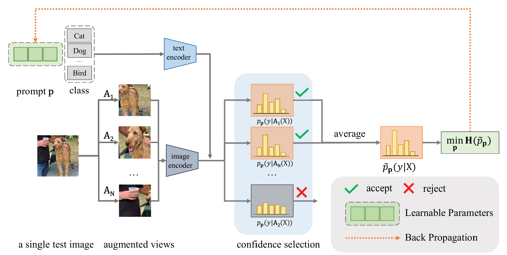

# Test-Time Adaptation (TTA) for image classification 🖼️

In this project, we work on **Test-Time Adaptation (TTA)**, which has recently gained traction due to its ability to enhance model performance without requiring access to training data. It involves improving the robustness of a pre-trained neural network to a test dataset, possibly by improving the network’s predictions on one test sample at a time.

In particular, we focus on **TTA for image classification**, particularly using **CLIP** [[2](#ref-clip2021)] with **TPT** [[3](#ref-tpt2022)]. Our approach involves adapting the model on **single-image test instances**, with the model being reset to its pre-trained state after each instance. This resembles **TTIA**, keeping the constraint of no retention of prior test-time knowledge (between batches, so between images).

<!--- visualize image using html formatting, so that i can scale it properly -->

   
  <em>Figure 1: Test-Time Prompt Tuning (TPT) for CLIP</em>

Additionally, we experiment with different techiqnues and approaches to try improving either the accuracy or inference speed of the model.

## Setup 🚀

The project is entirely self contained inside the jupyter notebook `report.ipynb`. It can be run using [Google Colab](https://colab.research.google.com/).

## Project Overview 🧠

1. Baseline - ZeroShot CLIP
1. Reproducing TPT: 
   - Reproduce TPT + simplified CoOp (without pretraining) (**Our contribution**)
   - Using OpenAI weights and OpenCLIP implementation
     - Compare zero-shot CLIP OpenAI (weights and implementation) with OpenCLIP (weights and implementation)
   - Using `Kornia` instead of `AugMix` / `torchvision.transforms` (**Extra: Our contribution**)
     - Recreate the AugMix pipeline in Kornia
     - Kornia is faster and can directly run on the GPU
     - Benchmarking the difference
1. Trying to get better at TTA (**Our contribution**)
   - A. Augment Top 10%
   - B. TPT with Top 10%
   - C. Self-Supervised Retrieval (Inspired by DinoV2) [[6](#ref-dinov2)]
   - D. TNT (Recreate the paper) [[5](#ref-dinov2)]
   - E. TNT with Top 10%
  
## References

1.  Liang J., He R., Tan T. (2025). _A Comprehensive Survey on Test-Time Adaptation Under Distribution Shifts_. IJCV, 133, 31-64, [Link](https://doi.org/10.1007/s11263-024-02181-w)
1.  Radford A., Kim K. J., Hallacy C., et al. (2021). _Learning Transferable Visual Models From Natural Language Supervision_. ICML 2021, 8748-8763, [Link](https://arxiv.org/abs/2103.00020)
1.  Shu M., Nie W., Huang D., et al. (2022). _Test-time Prompt Tuning for Zero-Shot Generalization in Vision-Language Models_. NeurIPS 2022, [Link](https://arxiv.org/abs/2209.07511)
1.  Zhou K., Yang J. Loy C. C., Liu Z. (2021). _Learning to Prompt for Vision-Language Models_. CoRR 2021, [Link](https://arxiv.org/abs/2109.01134)
1.  Imam R., et al. (2025). _Noise is an Efficient Learner for Zero-Shot Vision-Language Models_ [Link](https://arxiv.org/abs/2502.06019)
1.  Oquab M., et al. (2023). _DINOv2: Learning Robust Visual Features without Supervision_ [Link](https://arxiv.org/abs/2304.07193)
